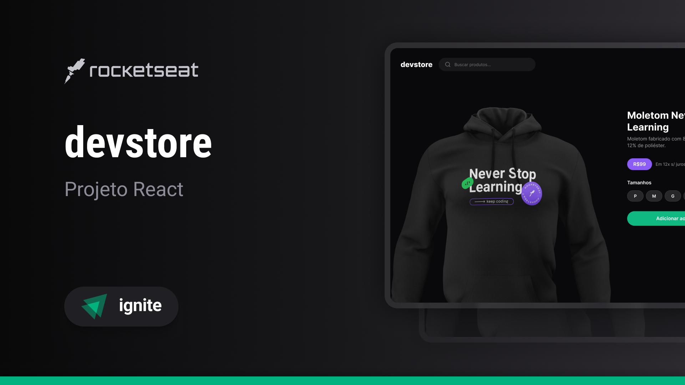

<h1 align="center">DevStore</h1>

<br>



## :dart: About

E-commerce project using the Next13 new features

## :sparkles: Features

:heavy_check_mark: API Route\
:heavy_check_mark: APP Route\
:heavy_check_mark: Metadata and others;

## :rocket: Technologies

The following tools were used in this project:

- [Next](https://nextjs.org/)
- [TypeScript](https://www.typescriptlang.org/)
- [Zod](https://zod.dev/)

## :white_check_mark: Requirements

Before starting :checkered_flag:, you need to have [Git](https://git-scm.com) and [Node](https://nodejs.org/en/) installed.

## :checkered_flag: Starting

```bash
# Clone this project
$ git clone https://github.com/davi1985/dev-store

# Access
$ cd dev-store

# Install dependencies
$ yarn

# Run the project
$ yarn start

# The server will initialize in the <http://localhost:3000>
```

Made with :heart: by <a href="https://github.com/davi1985" target="_blank">Davi Silva</a>

&#xa0;

<a href="#top">Back to top</a>
